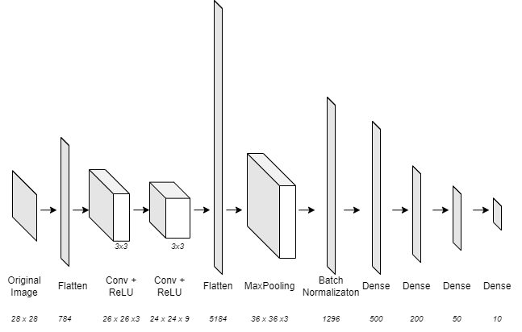
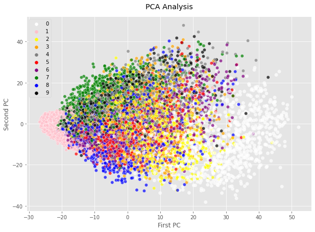
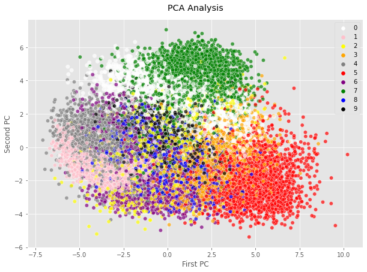
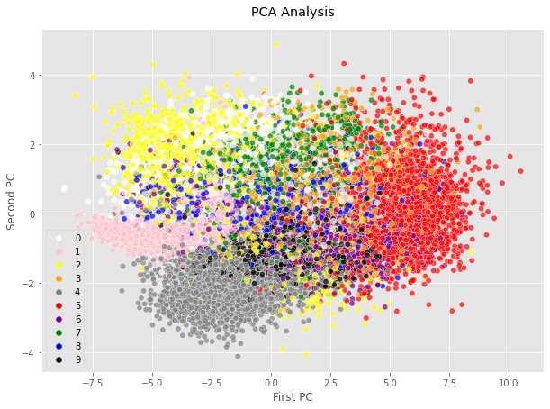
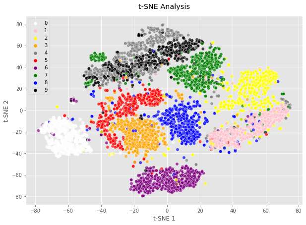
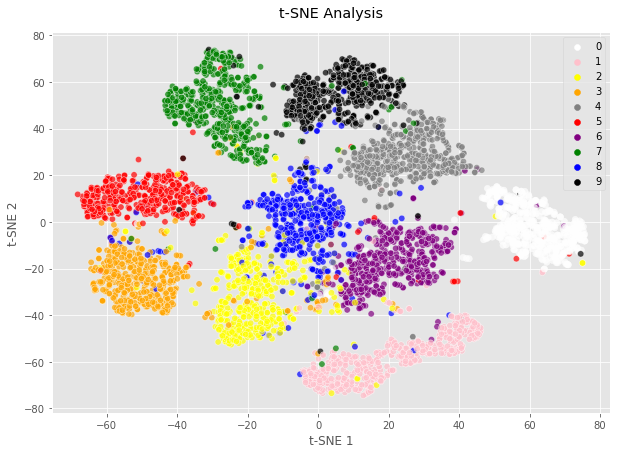
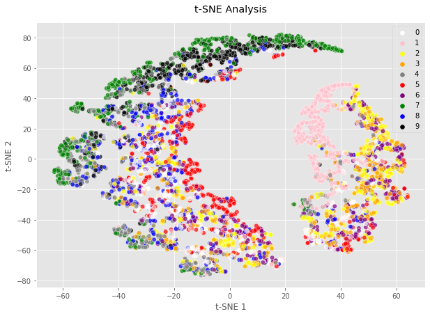

# :camera: Image Classification

This project aims to classify images from the MNIST-number dataset using a simple Convolution Neural Network (CNN).
One can understand that using only a few convolution layers can yield very good results. 

We will also use dimension reduction and visualization techniques like **Principal Component Analysis** (PCA) and **t-distributed Stochastic Neighbor Embedding** (t-SNE) in order to visualize the process of classification within the layers of our neural network.

## Using the code

You can use the jupyter version of the project with the file ```Image Classification.ipynb```, or the python file ```Image Classification.py```.

Other useful documents can be found in the **Ressources** Folder.


## Model 

The following figure gives us a scheme of the neural network, comprising Convolution Layers, ReLU layers, Max Pooling, Batch Normalization and Dense Layers for dimension reduction. 



*The written sizes are corresponding to the output format of data after each layer*

This architecture takes as input an 28x28 pixels image and returns a vector of size 10 corresponding to the probabilities of classes, through a SoftMax activation function. The Flatten Layers exist in order to easily compute the PCA and t-SNE operations.

The code used for our CNN is written below:

```
model = keras.Sequential([
    keras.layers.Flatten(input_shape=(28, 28)),  # input layer (1)
    keras.layers.Reshape((28,28, 1)),
    keras.layers.Conv2D(3,3, activation='relu'),
    keras.layers.Conv2D(9,3, activation='relu'),
    keras.layers.Flatten(), # intermediate flat layer for visualisation (5)
    keras.layers.Reshape((72,72,1), input_shape=(5184,) ),
    keras.layers.MaxPool2D((2,2)),
    keras.layers.Flatten(), # intermediate flat layer for visualisation (8)
    keras.layers.BatchNormalization(),
    keras.layers.Dense(500, activation='relu'),
    keras.layers.Dense(200, activation='relu'),
    keras.layers.Dense(50, activation='relu'), # intermediate flat layer for visualisation (12)
    keras.layers.Dense(10, activation='softmax') # output layer 
])
model.compile(optimizer='adam', 
              loss='sparse_categorical_crossentropy', 
              metrics=['accuracy'])
```              


## Results

The accuracies computed with the model after learning are the following:

**Train set** : Loss: 0.087 / Accuracy: 0.974

**Test set**  : Loss: 0.069 / Accuracy: 0.980

We can notice here that we don’t over-fitted the dataset because there is no decrease in accuracy while shifting from the Train set to the Test set.
Those results are very good which is expected because of the low complexity of the MNIST data set. Moreover, CNNs are very powerful and are capable of yielding very good accuracy.

## PCA and t-SNE visualization

### PCA visualisation

PCA is a popular technique for analyzing large datasets containing a high number of dimensions/features per observation, increasing the interpretability of data while preserving the maximum amount of information, and enabling the visualization of multidimensional data. This technique is very useful here because of the difficulty to interpret the input data images as 28x28 arrays.

In order to display the result of the PCA analysis, we will use the following piece of code:

```
myPalette = ['white', 'pink', 'yellow', 'orange', 'grey', 
             'red', 'purple', 'green', 'blue', 'black']
             
def PCA_2D(Xdata, Ylabels) :
    
    scaler = StandardScaler()
    scaler.fit(Xdata)
    X_scaled = scaler.transform(Xdata)
         
    pca_2 = PCA(n_components=2 , random_state=2022)
    pca_2.fit(X_scaled)
    X_pac_2 = pca_2.transform(X_scaled)
    
    plt.figure(figsize=(10,7))
    
    sns.scatterplot(x=X_pac_2[:, 0], y=X_pac_2[:,1], s=40, 
                    hue=Ylabels, palette=myPalette, alpha=0.7)
    
    plt.title('PCA Analysis', pad=15)
    plt.xlabel("First PC")
    plt.ylabel("Second PC")
    plt.show()
```    

The following figures represent the Principal Component Analysis taken after three selected layers of the model. These corresponding layers are: 
- The 2nd Convolution Layer (of size 24x24x9)
- The 3rd Dense layers (of size 200) 
- The last SoftMax activation Dense Layer



*The figure below is taken after the two convolution layers.*



*This figure is taken after the 3rd Dense Layer (of size 200).*



*The last Figure is taken after the last fully connected Layer.*

What we can see immediately is that the model tends to cluster the data points with the same label. After the convolution Layers the model still struggles to differentiate the types of digits, however the output after the last fully connected layers can be split into different distincts clusters as shown from the last PCA figure.

### t-SNE visualisation

t-distributed stochastic neighbor embedding (t-SNE) is a statistical method for visualizing high-dimensional data by giving each datapoint a location in a two or three-dimensional map. Due to representation issues, we will represent our data into a 2D plot like we did with the PCA analysis. The following python function helps us plotting the t-SNE analysis: 

```
myPalette = ['white', 'pink', 'yellow', 'orange', 'grey', 
             'red', 'purple', 'green', 'blue', 'black']

def TSNE_2D(Xdata, Ylabels) :
         
    tsne = TSNE(n_components=2)
    tsne_result = tsne.fit_transform(Xdata)
    
    plt.figure(figsize=(10,7))
    
    sns.scatterplot(x=tsne_result[:, 0], y=tsne_result[:,1], s=40, 
                    hue=Ylabels, palette=myPalette, alpha=0.7)
    
    plt.title('t-SNE Analysis', pad=15)
    plt.xlabel("t-SNE 1")
    plt.ylabel("t-SNE 2")
    plt.show()
```

We choose here to do the t-SNE analyses with the same layers as the PCA analysis.



*The figure below is taken after the two convolution layers.*



*This figure is taken after the 3rd Dense Layer (of size 200).*



*The last Figure is taken after the last fully connected Layer.*

We can notice here that the t-SNE algorithm shows how the clustering operations are made. The figure that shows the best result in terms of separations of different classes is the t-SNE Analysis after the 200 size Dense Layer. 


## Conclusion 

This simplified CNN model uses a combination of various types of Layers to achieve high-performances (98% accuracy on the test set) without using too much computation resources *(computation time is less than a minute with a Geforce GTX 1060 GPU)*. Moreover, the analysis made with tools like PCA and t-SNE helps us visualize how the classification process occurs between the neural layers. As we achieved a very high level of accuracy and that we used convolution layers and MaxPooling layers, which is a very satisfactory outcome.

