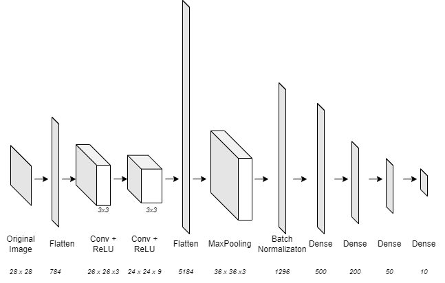
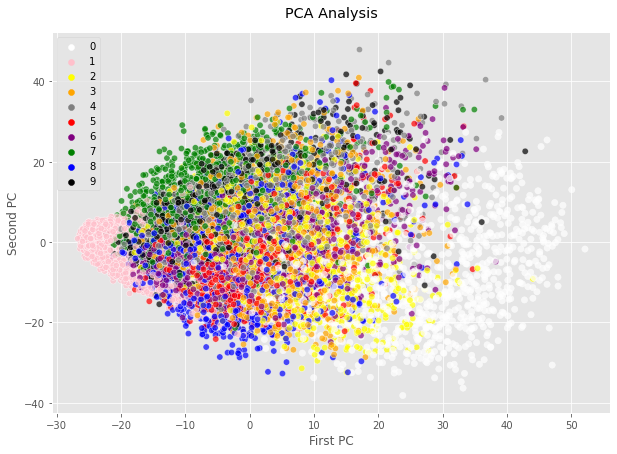
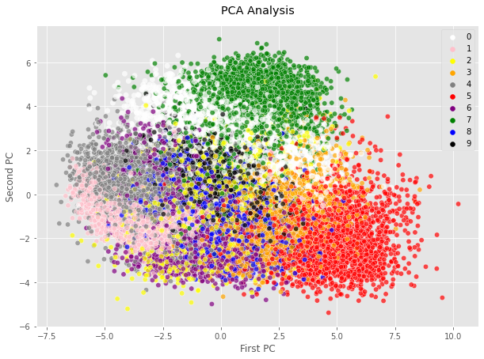
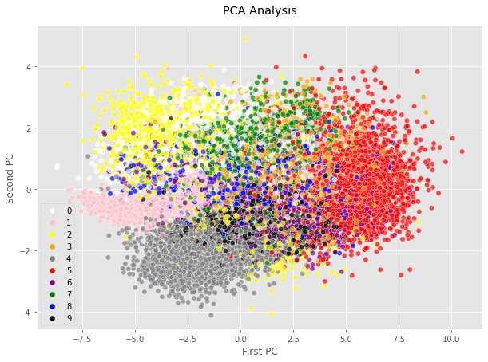

# :camera: Image Classification

This project aims to classify images from the MNIST-number dataset using a simple Convolution Neural Network (CNN).
One can understand that using only a few number of convolution layers can yeld to very good results. 

We will also use dimension reduction and visualisation techniques like **Principal Component Analysis** (PCA) and **t-distributed Stochastic Neighbor Embedding** (t-SNE) in order to visualise the process of classification within the layers of our neural network.

## Using the code

You can use the jupyter version of the project with the file ```Image Classification.ipynb```, or the python file ```Image Classification.py```.

Other useful documents can be found in the **Ressources** Folder.


## Model 

The following figure gives us a scheme of the neural network, comprising Convolution Layers, ReLU layers, Max Pooling, Batch Normalization and Dense Layers for dimension reduction. 



*The written sizes are corresponding to the output format of data after each layer*

This architecture takes as input an 28x28 pixels image and returns a vector of size 10 corresponding to the probabilities of classes, through a SoftMax activation function. The Flatten Layers exist in order to easily compute the PCA and t-SNE operations.

The code used for our CNN is written below:

```
model = keras.Sequential([
    keras.layers.Flatten(input_shape=(28, 28)),  # input layer (1)
    keras.layers.Reshape((28,28, 1)),
    keras.layers.Conv2D(3,3, activation='relu'),
    keras.layers.Conv2D(9,3, activation='relu'),
    keras.layers.Flatten(), # intermediate flat layer for visualisation (5)
    keras.layers.Reshape((72,72,1), input_shape=(5184,) ),
    keras.layers.MaxPool2D((2,2)),
    keras.layers.Flatten(), # intermediate flat layer for visualisation (8)
    keras.layers.BatchNormalization(),
    keras.layers.Dense(500, activation='relu'),
    keras.layers.Dense(200, activation='relu'),
    keras.layers.Dense(50, activation='relu'), # intermediate flat layer for visualisation (12)
    keras.layers.Dense(10, activation='softmax') # output layer 
])
model.compile(optimizer='adam', 
              loss='sparse_categorical_crossentropy', 
              metrics=['accuracy'])
```              


## Results

The accuracies computed with the model after learning are the following:

**Train set** : Loss: 0.087 / Accuracy: 0.974

**Test set**  : Loss: 0.069 / Accuracy: 0.980

We can notice here that we don’t over-fitted the model because there exists no decrease in accuracy while shifting from the Train set to the Test set.
Those results are very good which is expected because of the low complexity of the MNIST data set. Moreover, CNN are very powerfull and are capable of yielding very good accuracies.

## PCA and t-SNE visualisation

### PCA visualisation







### t-SNE visualisation
